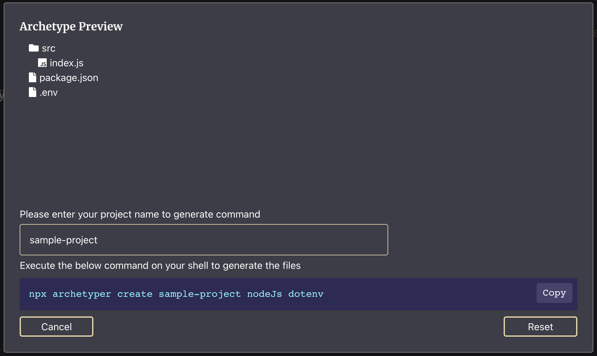

# Archetyper

 

<!-- ALL-CONTRIBUTORS-BADGE:START - Do not remove or modify this section -->

<!-- ALL-CONTRIBUTORS-BADGE:END -->

Setup your project files and directory structure in **one command**!

> This project is still in alpha stage and under active development. Released features should work with no issues.

## Features

- Cross platform. Should work on any platform that can run NodeJS
- Intuitive one line command for generating project files and directories
- No requirement for package install. Can be run with NPX directly
- JSON based config for the structure and file content template

## Getting Started

The required files and directories can be generated by using the following command:

`npx archetyper <option> <project name> <config/s>`

Example:

A simple node JS project with the starting point index.js, .env file and parsing and package.json files can be generated using:

`npx archetyper create sample-project nodeJs dotenv`

## Docs and Contribution guidelines

Developer and user docs coming soon!

Wish to contribute? We are in the process of framing our contribution guidelines, but until then, please note these points before raising a PR:

- Create an issue and discuss before starting on the feature/fix
- Ensure the code works!
- Follow good variable naming and coding conventions
- Try to keep the diff minimal

## License

MIT

## Maintainers

Team behind maintaining this project:

<table>
  <tr>
    <td align="center"><a href="https://unpackaged.reviews"> <b>Unpackaged Reviews</b></a></td>
  </tr>
</table>

## Contributors ✨

Thanks goes to these wonderful people ([emoji key](https://allcontributors.org/docs/en/emoji-key)):

<!-- ALL-CONTRIBUTORS-LIST:START - Do not remove or modify this section -->
<!-- prettier-ignore-start -->
<!-- markdownlint-disable -->
<table>
  <tr>
    <td align="center"><a href="https://github.com/KaushikIyer16"> <b>Kaushik N S Iyer</b></a> <a href="https://github.com/Unpackaged-Reviews-Core/archetyper/commits?author=KaushikIyer16" title="Code">💻</a></td>
    <td align="center"><a href="http://hpmahesh.me"> <b>Mahesh H P</b></a> <a href="https://github.com/Unpackaged-Reviews-Core/archetyper/commits?author=maheshhp" title="Documentation">📖</a></td>
  </tr>
</table>

<!-- markdownlint-restore -->
<!-- prettier-ignore-end -->

<!-- ALL-CONTRIBUTORS-LIST:END -->

This project follows the [all-contributors](https://github.com/all-contributors/all-contributors) specification. Contributions of any kind welcome!
